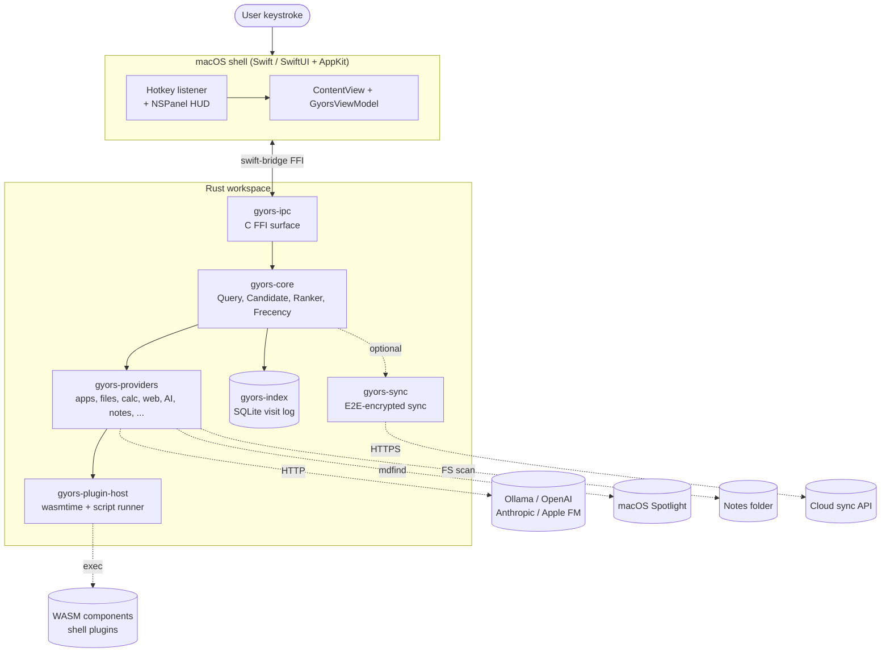

# [Gyors](https://gyo.rs)

A keyboard-first launcher for macOS. Native SwiftUI shell, Rust core.

## Why

It was fun and I wanted to build my own launcher. Heavily inspired by Alfred, Raycast.

## Architecture



## Crates

| Crate | Purpose |
|---|---|
| `gyors-core` | Query, Candidate, Provider trait, NucleoRanker, Frecency |
| `gyors-index` | SQLite-backed visit log for frecency |
| `gyors-plugin-host` | wasmtime Component Model + script plugin runner (stub) |
| `gyors-providers` | Built-ins: apps, calculator, files, etc. |
| `gyors-ipc` | swift-bridge FFI exposed to the Swift shell |
| `gyors-sync` | Optional E2E-encrypted sync client (alpha) |
| `gyors-cli` | Headless CLI (bin: `gyors`) - query, plugin scaffold/validate/test |

## Quickstart

Build and launch the macOS app:

```sh
./scripts/build-app.sh release          # produces macos/build/Gyors.app
open macos/build/Gyors.app
```

Then press **Option+Shift+Space** to toggle the launcher panel. This can be configured in `config.json`.

### Query modes

- **Default** - apps + calculator + system commands (fast, no file I/O)
- **`'` prefix** - also search filesystem via Spotlight (`mdfind`). Example: `'report.pdf`
- **`clip` / `paste` / `cb` keyword** - clipboard history. Bare keyword shows the last 20 copies; `clip <pattern>` filters by substring
- **`>` prefix** - shell command. `>ls -la` → single "Run: …" candidate → executes via your login shell (`$SHELL -ic`, falls back to `/bin/sh -c`). No output capture

### Keyword shortcuts

| keyword | what |
|---|---|
| `g <q>` | Google search |
| `ddg <q>` | DuckDuckGo |
| `gh <q>` | GitHub code search |
| `so <q>` | Stack Overflow |
| `yt <q>` | YouTube |
| `npm <q>` | npm |
| `w <q>` | Wikipedia |
| `docs <q>` | docs.rs |
| `b64 <t>` / `b64d <t>` | base64 encode / decode |
| `url <t>` / `urld <t>` | URL encode / decode |
| `md5` / `sha1` / `sha256 <t>` | hex digest |
| `kill <name>` | find process, SIGTERM default, SIGKILL via `→` |
| `emoji <s>` or `:s` | find & copy an emoji |
| `#ff5733` / `rgb 255 87 51` / `hsl 11 100 60` | color converter (hex / rgb / hsl / hsv) |
| `now` / `ts <unix>` / `date +3d` | time & date utilities |
| `uuid` / `uuid7` | generate UUID |
| `passw [len]` | generate random password |
| `case [kind] <text>` | case converter (snake / camel / pascal / kebab / constant / title / upper / lower) |
| `blake3` / `sha3` / `sha3-512 <text>` | more hex digests |
| `wm left` / `wm full` / `wm center` / `wm <geometry>` | resize/move current window |
| `screen` / `screen clip` / `screen win` / `screen full` | screenshot (via `screencapture`) |
| `repo [name]` | open a git repository (Finder / Terminal / VSCode) |
| `def <word>` | look up in macOS Dictionary |
| `qr <text>` | copy QR code image to clipboard |
| `ai <question>` / `ask <question>` | ask configured AI (Ollama / OpenAI / Anthropic) |
| `note [filter]` / `notes [filter]` | find & open markdown notes |
| `note new <title>` | create a new note and open it |

### AI configuration

Default: Ollama at `http://localhost:11434` with model `llama3.2`. Override in `config.json`:

```json
{
  "ai": {
    "provider": "openai",
    "model":    "gpt-5-4-nano",
    "api_key":  "sk-..."
  }
}
```

Supported providers: `ollama`, `openai`, `anthropic`.

### Notes

Set the folder in `config.json`:

```json
{ "notes_folder": "~/Documents/Notes" }
```

(Default: `~/Documents/Notes` if it exists, else `~/Notes`.) Title comes from the first `# Heading` line if present, else from filename.

### Themes

Pick a theme from the menu-bar icon - **Theme**:

- **System** (default) - follows macOS dark/light
- **Midnight** -deep slate + violet
- **Sunset** - warm amber + magenta
- **Forest** - emerald + cream
- **Monochrome** - pure grayscale
- **Neon** - black + cyan

### Chain actions

Press **→** on any result to see its secondary actions (e.g. apps offer *Show in Finder*; files offer *Reveal in Finder* and *Copy Path*). **↑**/**↓** navigates, **⏎** runs the chosen action, **←** or **⎋** returns.

### System commands

| type | command |
|---|---|
| `lock` | Lock Screen |
| `sleep` | Sleep |
| `trash` | Empty Trash |
| `restart` | Restart (prompts for confirmation) |
| `shutdown` | Shut Down (prompts) |
| `logout` | Log Out (prompts) |
| `activity` | Open Activity Monitor |

### Configuring hotkey

On first launch Gyors creates `~/Library/Application Support/Gyors/config.json`:

```json
{
  "hotkey": "opt+shift+space"
}
```

Edit and relaunch.

Examples: `"cmd+space"`, `"ctrl+alt+k"`, `"opt shift space"`.

### Cloud sync (alpha)

Optional. Gyors can sync notes, snippets, themes, and clipboard history between Macs via E2E. Items leave your mac as opaque ciphertext; server only sees namespace + id + version + blob.

Status: **alpha**.

Omit entirely from the build:

```sh
WITH_CLOUD=0 ./scripts/build-app.sh release
```

That strips sync FFI, SyncPanel UI, and the gyors-sync crate from built binary.

AI provider stack can be omitted same way:

```sh
WITH_AI=0 ./scripts/build-app.sh release
```

### Build requirements

- Rust >= 1.80
- macOS >= 14 (Sonoma)
- Swift 5.9+ (CommandLineTools sufficient)

## Help needed

Apple specific parts. macOS permissions, etc.

Expect features to change, break, evolve. I'm not the best with macOS and Swift.

## License

MIT. See [LICENSE](LICENSE.md).
